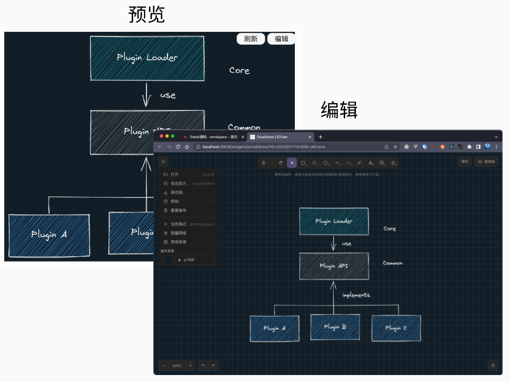

# 思源笔记excalidraw挂件

基于 [excalidraw](https://docs.excalidraw.com/docs) 实现的思源笔记挂件。

插件效果（预览&编辑）：

> 每次作图后都懒得维护源文件，所以就有了这个插件。svg即是图片，也是源文件~

## 功能

1. 挂件默认只渲染SVG图片而非整个excalidraw画图应用，显示效果与普通图片一致
2. 点击 "编辑" 按钮打在新窗口打开excalidraw画图应用进行图片编辑
3. 在图片编辑完毕后点击excalidraw画图应用的 "保存" 按钮，然后返回预览界面点击 "刷新" 按钮即可看到效果