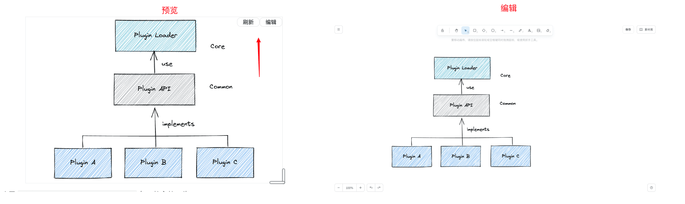

# 思源笔记excalidraw挂件

基于 [excalidraw](https://docs.excalidraw.com/docs) 实现的思源笔记挂件。

插件效果（预览&编辑）：

> 每次作图后都懒得维护源文件，所以就有了这个挂件。svg即是图片，也是源文件~

## 功能

1. 挂件默认只渲染SVG图片而非整个excalidraw画图应用，显示效果与普通图片一致
2. 点击 "编辑" 按钮打在新窗口打开excalidraw画图应用进行图片编辑
3. 在图片编辑完毕后点击excalidraw画图应用的 "保存" 按钮，然后返回预览界面点击 "刷新" 按钮即可看到效果

## 开发指南

项目源码在本仓库的 [dev](https://github.com/ooooooook/widget-excalidraw/tree/dev) 分支。

## 更新日志

#### v1.0.2

- 修复开启访问授权码时打开编辑页面为空白问题

#### v1.0.1

- 修复编辑界面UI配置无法保存问题

#### v1.0.0

- 支持自动保存，默认开启，可在左侧菜单关闭
- 保存文件成功后自动清除不再被引用的历史文件，避免产生未引用资源

#### v0.0.3

- 支持中文手写字体。PS: 字体文件拷贝自 [superdraw](https://github.com/zuoez02/superdraw) 项目
- 优化保存提示弹窗

#### v0.0.2

- 修复基础路径错误

#### v0.0.1

- 初始版本